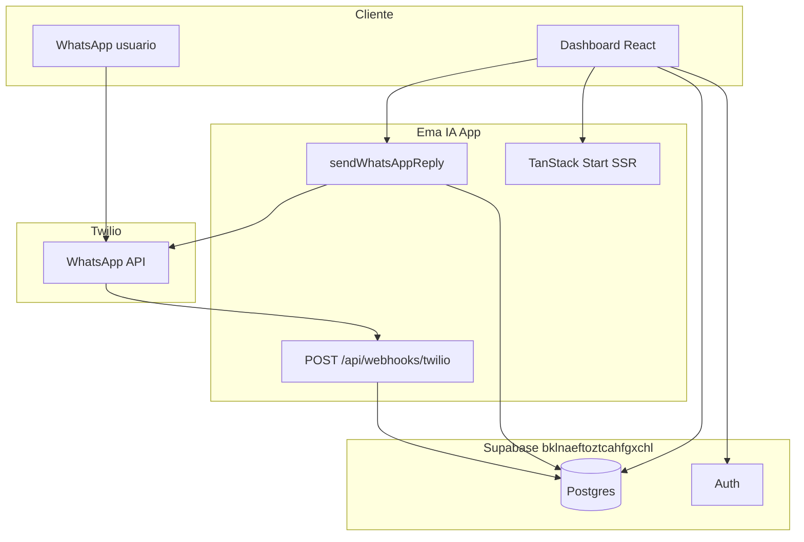

# Estado del proyecto — Ema IA (ema-s-beauty-ai)

**Última actualización:** 2026-05-19 (respaldo WhatsApp operativo)  
**Repositorio:** [elsegundocorreodejose-lab/ema-s-beauty-ai](https://github.com/elsegundocorreodejose-lab/ema-s-beauty-ai)  
**Rama:** `main`

---

## Resumen ejecutivo

**Ema IA** es un panel web para clínicas de estética: landing, autenticación, dashboard (mensajes WhatsApp, citas, configuración). La integración **WhatsApp vía Twilio** ya está implementada en código (webhook entrante + envío desde el panel). La capa de **IA conversacional** (respuestas inteligentes de Ema) sigue pendiente.

| Área | Estado |
|------|--------|
| Frontend MVP | Implementado |
| Auth + roles Supabase | Implementado |
| Base de datos (proyecto MCP) | Esquema + Twilio aplicados |
| WhatsApp Twilio | **Operativo** — webhook + envío vía Supabase Edge (ver `docs/RESPALDO-2026-05-19-whatsapp-funcionando.md`) |
| IA / automatización Ema | Pendiente |
| Despliegue producción | Pendiente |
| Tests / CI | Pendiente |

**Progreso global estimado:** ~55%

---

## Stack técnico

| Capa | Tecnología |
|------|------------|
| UI | React 19, Tailwind 4, shadcn/ui |
| Routing / SSR | TanStack Router, TanStack Start |
| Estado remoto | TanStack React Query |
| Auth + BD | Supabase (Auth, Postgres, Realtime) |
| WhatsApp | Twilio API (`twilio` npm) |
| Build | Vite 7, `@lovable.dev/vite-tanstack-config` |
| Deploy previsto | Cloudflare Workers |

---

## Funcionalidades por módulo

### Rutas web

| Ruta | Estado | Notas |
|------|--------|-------|
| `/` | Hecho | Landing marketing |
| `/login` | Hecho | Registro + login Supabase |
| `/dashboard` | Hecho | Requiere sesión |

### Dashboard — Mensajes

| Función | Estado |
|---------|--------|
| Listar conversaciones por teléfono | Hecho (poll 5s) |
| Vista tipo chat | Hecho |
| Recibir mensajes vía Twilio webhook | Hecho (servidor) |
| Enviar respuesta manual vía Twilio | Hecho (server function + UI) |
| Respuesta automática fija (`TWILIO_AUTO_REPLY_MESSAGE`) | Hecho (opcional en `.env`) |
| Respuesta IA contextual (Ema) | Pendiente |

### Dashboard — Citas

| Función | Estado |
|---------|--------|
| Listar / filtrar próximas citas | Hecho |
| Cambiar estado (pendiente / confirmada / cancelada) | Hecho |
| Crear cita manual | Hecho |
| Recordatorios (`reminder_sent`) | Campo en BD, sin job |

### Dashboard — Configuración

| Función | Estado |
|---------|--------|
| Datos de la clínica, servicios, horarios | Hecho |
| Guardar (solo rol **admin**) | Hecho (RLS) |
| Panel Twilio (estado, webhook URL, número) | Hecho |
| Sincronizar número con `TWILIO_WHATSAPP_FROM` en `.env` | Manual hoy |

### API / servidor

| Endpoint / función | Estado |
|--------------------|--------|
| `POST /api/webhooks/twilio` | Hecho — valida firma Twilio |
| `sendWhatsAppReply` (server fn) | Hecho — auth Bearer |
| `getTwilioStatus` (server fn) | Hecho |
| `attachSupabaseAuth` en `start.ts` | Hecho |

---

## Supabase (proyecto MCP: AsistenteEma)

| Campo | Valor |
|-------|--------|
| Project ID | `bklnaeftoztcahfgxchl` |
| URL | `https://bklnaeftoztcahfgxchl.supabase.co` |

### Migraciones aplicadas

| Versión | Nombre |
|---------|--------|
| `20260520112026` | `ema_beauty_initial_schema` |
| `20260520115351` | `twilio_message_sid` |

### Tablas `public`

| Tabla | Filas | Notas |
|-------|-------|-------|
| `esthetic_settings` | 1 | Fila por defecto |
| `messages` | 0 | Incluye `twilio_message_sid` (único) |
| `appointments` | 0 | |
| `profiles` | 0 | Se crean al registrarse |
| `user_roles` | 0 | Primer usuario → `admin` |

### Proyecto Lovable (histórico)

| Project ID | `zkzgejxtxitmaxymbhqo` |
| Estado | No actualizado por MCP — usar solo si Lovable apunta aquí |

---

## Variables de entorno necesarias

Ver [.env.example](.env.example) y [docs/WHATSAPP_TWILIO.md](docs/WHATSAPP_TWILIO.md).

| Grupo | Variables clave |
|-------|-----------------|
| Supabase | `SUPABASE_URL`, `SUPABASE_PUBLISHABLE_KEY`, `VITE_*`, `SUPABASE_SERVICE_ROLE_KEY` |
| App | `PUBLIC_APP_URL` |
| Twilio | `TWILIO_ACCOUNT_SID`, `TWILIO_AUTH_TOKEN`, `TWILIO_WHATSAPP_FROM` |
| Opcional | `TWILIO_AUTO_REPLY_MESSAGE`, `TWILIO_WEBHOOK_PUBLIC_URL` |

---

## Repositorio Git

### En GitHub (`origin/main`)

- README, `.env.example` (parcial), `.gitignore` reforzado, sin `.env`
- `config.toml` → proyecto `bklnaeftoztcahfgxchl` (commit `3b1deb4`, puede estar sin push)

### Cambios locales sin commitear

- Integración Twilio (`src/lib/twilio/`, `src/functions/whatsapp.ts`, `server.ts`, UI)
- `package.json` + `twilio` dependency
- Migración SQL local `20260520120000_twilio_integration.sql`
- `docs/WHATSAPP_TWILIO.md`
- Este archivo `ESTADO_PROYECTO.md` (actualizado)

---

## Desarrollo local

```powershell
cd C:\Users\Jofi\Documents\ema-s-beauty-ai
npm install
# Configurar .env (copiar de .env.example)
npm run dev
```

| Requisito | Detalle |
|-----------|---------|
| URL app | http://localhost:8080 |
| Twilio en local | Túnel HTTPS (`cloudflared`, ngrok) + `PUBLIC_APP_URL` del túnel |
| Sin `npm run dev` | `ERR_CONNECTION_REFUSED` en el navegador |

---

## Riesgos y deuda técnica

| Tema | Impacto |
|------|---------|
| RLS permisiva en `messages` / `appointments` | OK para 1 clínica; malo multi-tenant |
| Claves en historial Git (`.env` antiguo) | Rotar en Supabase |
| WhatsApp 24h / plantillas Meta | Envío manual fuera de ventana puede fallar |
| Sin tests automatizados | Regresiones no detectadas |
| IA no conectada | Producto incompleto vs promesa landing |
| Advisor Supabase (WARN seguridad) | Ver [documentación linter](https://supabase.com/docs/guides/database/database-linter) |

---

## Checklist para completar el proyecto

### Fase 1 — Entorno y base (prioridad alta)

- [ ] Completar `.env` con Supabase + `SUPABASE_SERVICE_ROLE_KEY`
- [ ] Completar variables Twilio en `.env`
- [ ] `npm run dev` y verificar http://localhost:8080
- [ ] Supabase Auth: Site URL + Redirect URLs (`localhost` + producción)
- [ ] Registrar primer usuario y confirmar rol **admin**
- [ ] Commit + push: Twilio, docs, migración, `ESTADO_PROYECTO.md`
- [ ] Probar crear cita y guardar configuración de clínica

### Fase 2 — WhatsApp Twilio en funcionamiento

- [ ] Cuenta Twilio + WhatsApp Sandbox o sender aprobado
- [ ] Configurar webhook POST → `{PUBLIC_APP_URL}/api/webhooks/twilio`
- [ ] Túnel HTTPS en desarrollo (`cloudflared` / ngrok)
- [ ] Enviar mensaje de prueba al número Twilio → aparece en **Mensajes**
- [ ] Responder desde el panel → cliente recibe en WhatsApp
- [ ] (Opcional) Activar `TWILIO_AUTO_REPLY_MESSAGE`
- [ ] Documentar número de producción en `esthetic_settings.twilio_whatsapp_from`

### Fase 3 — IA Ema (valor de negocio)

- [ ] Definir proveedor LLM (OpenAI, Anthropic, etc.)
- [ ] Tras mensaje entrante: generar respuesta con contexto (`esthetic_settings`, historial)
- [ ] Enviar respuesta vía `sendWhatsAppMessage` como `sender: ema`
- [ ] Límites, moderación y fallback si la IA falla
- [ ] Crear/actualizar citas desde intención detectada en chat

### Fase 4 — Producto y operación

- [ ] Realtime Supabase en lugar de solo polling
- [ ] Recordatorios de citas (cron / Edge Function + `reminder_sent`)
- [ ] Plantillas WhatsApp aprobadas para fuera de ventana 24h
- [ ] Pruebas móvil y accesibilidad básica
- [ ] Endurecer RLS si habrá varias clínicas

### Fase 5 — Seguridad y compliance

- [ ] Rotar claves Supabase si estuvieron expuestas
- [ ] Revisar Advisor Supabase y corregir WARN críticos
- [ ] Secrets solo en servidor / Cloudflare (nunca `VITE_*` para service role)
- [ ] Política de retención de mensajes y datos personales

### Fase 6 — Despliegue producción

- [ ] `npm run build` exitoso
- [ ] Desplegar en Cloudflare Workers (Wrangler)
- [ ] Variables de entorno en producción
- [ ] Dominio HTTPS + webhook Twilio apuntando a prod
- [ ] Smoke test: auth, dashboard, webhook, envío

### Fase 7 — Calidad continua

- [ ] ESLint en CI
- [ ] Tests E2E (login, webhook mock, envío mock)
- [ ] Monitoreo errores (logs Twilio + app)
- [ ] Actualizar `types.ts` tras cada migración Supabase

---

## Métricas de avance por bloque

| Bloque | % |
|--------|---|
| Frontend / UX | 85% |
| Auth + Supabase schema | 95% |
| Twilio (código) | 80% |
| Twilio (configurado en prod) | 0% |
| IA conversacional | 0% |
| Citas + recordatorios | 60% |
| Seguridad avanzada | 30% |
| Deploy | 15% |
| Tests / CI | 0% |

---

## Documentación del repo

| Archivo | Contenido |
|---------|-----------|
| [README.md](./README.md) | Instalación general |
| [docs/WHATSAPP_TWILIO.md](./docs/WHATSAPP_TWILIO.md) | Configuración Twilio paso a paso |
| [.env.example](./.env.example) | Plantilla de variables |
| [supabase/migrations/](./supabase/migrations/) | SQL versionado |

---

## Próximas 3 acciones recomendadas

1. Rellenar `.env` y levantar túnel + Twilio Sandbox para probar el flujo completo.  
2. Hacer **commit y push** de la integración Twilio y esta documentación.  
3. Iniciar **Fase 3** (IA) para que Ema responda sola, no solo mensajes fijos o manuales.

---

## Diagrama de arquitectura actual


