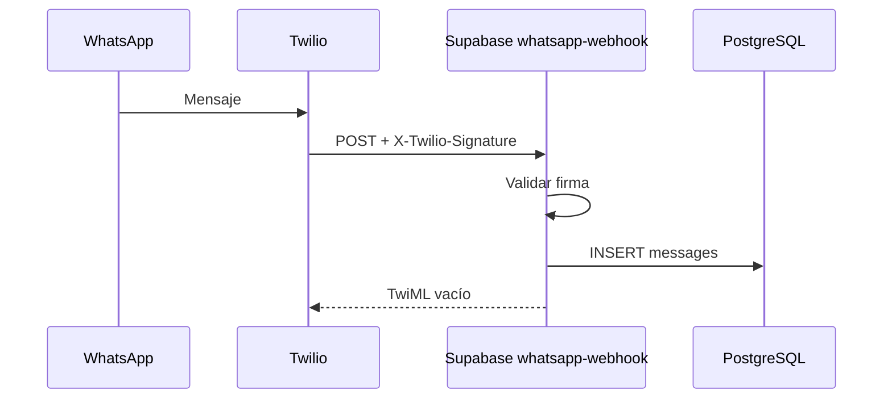
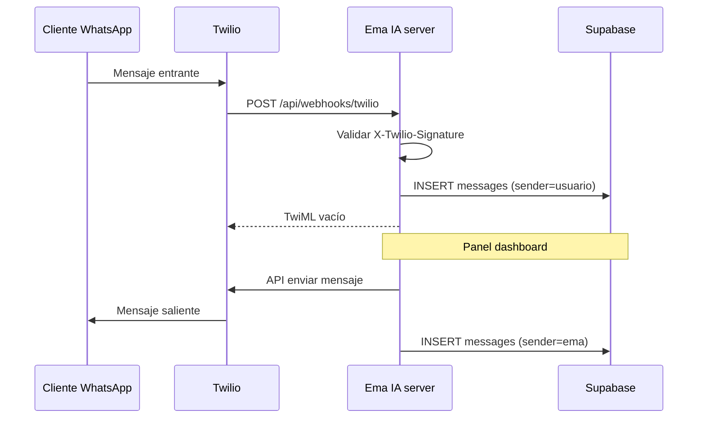

# WhatsApp con Twilio — Ema IA

## Webhook en Supabase Edge Function (recomendado)

Recibe mensajes **sin** tener la app Node/Cloudflare encendida ni un túnel local.

| Item | Valor |
|------|--------|
| Función | `whatsapp-webhook` |
| URL | `https://bklnaeftoztcahfgxchl.supabase.co/functions/v1/whatsapp-webhook` |
| Código | `supabase/functions/whatsapp-webhook/` |
| JWT | Desactivado (`verify_jwt = false`); autenticación vía firma Twilio |

### Secretos en Supabase Dashboard

[Project → Edge Functions → Secrets](https://supabase.com/dashboard/project/bklnaeftoztcahfgxchl/functions/secrets)

| Secreto | Obligatorio |
|---------|-------------|
| `TWILIO_ACCOUNT_SID` | Sí |
| `TWILIO_AUTH_TOKEN` | Sí |
| `TWILIO_WHATSAPP_FROM` | Sí (ej. `whatsapp:+14155238886`) |
| `TWILIO_AUTO_REPLY_MESSAGE` | No |
| `TWILIO_WEBHOOK_PUBLIC_URL` | No — URL **exacta** registrada en Twilio si difiere de la por defecto |

`SUPABASE_URL` y `SUPABASE_SERVICE_ROLE_KEY` las inyecta Supabase automáticamente en Edge Functions.

### Twilio Console

1. **Messaging** → **WhatsApp Sandbox** (o tu sender).
2. **When a message comes in**: `POST`
3. **URL**: `https://bklnaeftoztcahfgxchl.supabase.co/functions/v1/whatsapp-webhook`
4. Desde tu WhatsApp: `join <código>` al número sandbox.

### Desplegar cambios

```bash
supabase functions deploy whatsapp-webhook --no-verify-jwt
```

(o vía MCP / CI del proyecto).

### Flujo Edge Function



---

## Variables de entorno (servidor de la app)

| Variable | Obligatoria | Descripción |
|----------|-------------|-------------|
| `TWILIO_ACCOUNT_SID` | Sí | Account SID de Twilio |
| `TWILIO_AUTH_TOKEN` | Sí | Auth Token (valida firma del webhook) |
| `TWILIO_WHATSAPP_FROM` | Sí | Número remitente, ej. `whatsapp:+14155238886` |
| `PUBLIC_APP_URL` | Sí | URL base pública, ej. `https://tu-app.com` o `http://localhost:8080` |
| `SUPABASE_SERVICE_ROLE_KEY` | Sí | Insertar mensajes entrantes sin sesión de usuario |
| `TWILIO_WEBHOOK_PUBLIC_URL` | No | Si Twilio apunta a otra URL exacta |
| `TWILIO_AUTO_REPLY_MESSAGE` | No | Texto de respuesta automática al recibir mensaje |

Copia `.env.example` a `.env` y rellena los valores.

## Setup rápido en Windows

1. Rellena en `.env`: `SUPABASE_SERVICE_ROLE_KEY`, `TWILIO_ACCOUNT_SID`, `TWILIO_AUTH_TOKEN`, `TWILIO_WHATSAPP_FROM`.
2. Ejecuta:

   ```powershell
   .\scripts\setup-twilio-dev.ps1
   ```

   (instala deps, levanta dev si hace falta, túnel HTTPS y actualiza `PUBLIC_APP_URL`).
3. Con credenciales Twilio reales:

   ```powershell
   .\scripts\configure-twilio-sandbox.ps1
   ```

4. Desde tu WhatsApp: envía `join <código>` al número sandbox de Twilio.
5. Reinicia `npm run dev` tras cambiar `.env`.

## Configurar Twilio Console (manual)

1. Crea cuenta en [twilio.com](https://www.twilio.com).
2. Activa **WhatsApp Sandbox** (pruebas) o un **WhatsApp Sender** aprobado (producción).
3. En **Messaging** → configuración del sandbox/sender:
   - **When a message comes in**: `POST`
   - **URL**: `https://TU_DOMINIO/api/webhooks/twilio` (la muestra el panel Configuración o `setup-twilio-dev.ps1`)
4. En desarrollo local usa un túnel (cloudflared, localtunnel o ngrok):

   ```bash
   cloudflared tunnel --url http://localhost:8082
   ```

   Pon `PUBLIC_APP_URL=https://xxxx.trycloudflare.com` en `.env` (solo la base, sin `/api/...`).

## Flujo de la aplicación



## Enviar desde el panel

1. Inicia sesión en `/dashboard` → pestaña **Mensajes**.
2. Selecciona una conversación.
3. Escribe y pulsa enviar (API Twilio).

El servidor intenta primero las variables `TWILIO_*` del `.env`. Si no están, llama a la Edge Function **`whatsapp-send`** (mismos secretos que el webhook en Supabase). Debes estar logueado en Ema.

**Nota:** Fuera de la ventana de 24h de WhatsApp solo puedes enviar **plantillas** aprobadas por Meta. El sandbox de Twilio tiene reglas propias para pruebas.

## Endpoints

| Método | Ruta | Uso |
|--------|------|-----|
| `POST` | `https://…supabase.co/functions/v1/whatsapp-webhook` | Webhook entrante (Twilio, **recomendado**) |
| `POST` | `https://…supabase.co/functions/v1/whatsapp-send` | Envío desde Mensajes (JWT usuario) |
| `POST` | `/api/webhooks/twilio` | Webhook entrante (app Node/Workers, alternativa) |
| RPC | `sendWhatsAppReply` | Envío desde el dashboard (autenticado) |

## Seguridad

- El webhook valida la firma `X-Twilio-Signature`.
- `TWILIO_AUTH_TOKEN` y `SUPABASE_SERVICE_ROLE_KEY` solo en servidor.
- No expongas estas claves en el cliente ni en Git.
